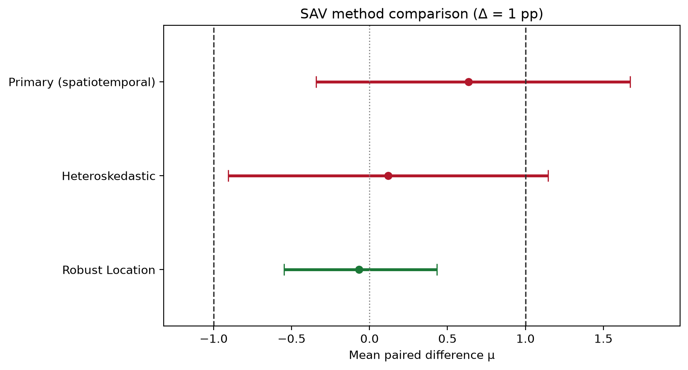

# Worked example: SAV method equivalence

This vignette walks through a complete equivalence analysis of the kind pyTOST was
built for: deciding whether a fast proxy model can replace an expensive reference
method, when the paired differences are correlated in space and repeated over time.

All numbers below are produced by [`scripts/sav_worked_example.py`](../scripts/sav_worked_example.py)
on synthetic data, so the example is fully reproducible:

```bash
pixi run -e test python scripts/sav_worked_example.py
```

## The question

Solar access value (SAV) quantifies how much usable solar resource a building site
receives. Our reference method (arm **A**) is a detailed ray-tracing model that is slow
and costly to run. A proxy model (arm **B**) is far cheaper. We want to know whether
the proxy is *practically interchangeable* with the reference.

This is an equivalence question, not a difference question. A conventional t-test that
fails to reject "no difference" does **not** establish interchangeability — it may just
reflect low power. TOST answers the question we actually care about: is the mean paired
difference confidently within a tolerance we consider negligible?

Here the domain tolerance is **Δ = 1.0 percentage point** of SAV. Differences smaller
than that do not change siting decisions.

## The data

We observe 30 building sites across 6 monthly snapshots, giving a 180-row panel of
paired differences `sav_diff = B - A`:

```text
Panel shape: (180, 5)
Neighborhoods: ['east_north', 'east_south', 'west_north', 'west_south']
Months: [0, 1, 2, 3, 4, 5]
Naive mean SAV difference: +0.119 pp
```

Two dependence structures are present, and both are physical rather than incidental:

- **Spatial.** Nearby sites share shading geometry, terrain, and sky-view conditions,
  so their SAV errors move together. Sites are grouped into four neighborhoods.
- **Temporal.** Each site is measured repeatedly, and solar geometry changes smoothly
  month to month, so a site's errors persist across time.

The observed mean difference is `+0.119 pp` — comfortably inside our 1.0 pp tolerance.
The question is how much confidence that point estimate actually carries.

## The naive analysis (and why it misleads)

Treating the 180 rows as independent is the default reflex:

```python
from pyTOST import WorkflowOptions, run_tost

naive = run_tost(
    panel,
    y="sav_diff",
    margins=[1.0],
    alpha=0.05,
    engine="iid",
    options=WorkflowOptions(do_sensitivity=False, bootstrap_B=0),
)
print(naive.summary())
```

```text
Engine: iid
Method: IID OLS (t-CI)

Primary result
--------------
Delta  mu_hat  ci_low   ci_high  Decision
-----  ------  -------  -------  ----------
1      0.1186  -0.1290  0.3661   EQUIVALENT
```

The IID engine declares equivalence with a tight interval of width 0.50 pp. But it
reached that confidence by counting all 180 rows as 180 independent pieces of evidence.
They are not: 30 sites measured 6 times, with spatial clustering, carry substantially
less information than 180 independent observations. The interval is too narrow because
the effective sample size is much smaller than the row count.

## The dependence-aware analysis

The spatiotemporal engine models the dependence explicitly — a separable
AR(1) ⊗ Matérn covariance — and propagates it into the interval:

```python
result = run_tost(
    panel,
    y="sav_diff",
    margins=[1.0],
    alpha=0.05,
    engine="spatiotemporal",
    cluster="neighborhood",
    time="month",
    x="x",
    ycoord="ycoord",
    options=WorkflowOptions(
        do_sensitivity=True, bootstrap_B=200, robust_location_B=200, seed=424242
    ),
)
print(result.summary())
```

```text
Engine: spatiotemporal
Method: Joint separable spatiotemporal ML (AR1 ⊗ Matérn) + Parametric bootstrap CI (B=400)

Primary result
--------------
Delta  mu_hat  ci_low   ci_high  Decision
-----  ------  -------  -------  --------------
1      0.6341  -0.3416  1.6714   NOT EQUIVALENT

Sensitivity
-----------
Heteroskedastic:
  Delta  mu_hat  ci_low   ci_high  Decision
  -----  ------  -------  -------  --------------
  1      0.1186  -0.9069  1.1440   NOT EQUIVALENT

Robust Location:
  Delta  mu_hat   ci_low   ci_high  Decision
  -----  -------  -------  -------  ----------
  1      -0.0680  -0.5478  0.4326   EQUIVALENT

Bootstrap
---------
Method: cluster_bootstrap
Replicates: 200
Mean CI (percentile, 90%): [-0.2331, 0.4664]
```

**The decision reverses.** The interval widens from 0.50 pp to 2.01 pp — roughly
four times wider — and its upper bound, 1.67 pp, now sits outside the 1.0 pp tolerance.
On this evidence we cannot certify the proxy as interchangeable.



### Why the point estimate also moved

The spatiotemporal estimate (`0.6341`) differs from the raw sample mean (`0.1186`)
because the default GLS estimator down-weights observations that are redundant given
their correlated neighbors, rather than weighting every row equally. That is a
different — and under dependence, more defensible — estimand.

If you want the dependence-aware *variance* while keeping the plain sample mean as the
estimand, request the equal-weighted mode:

```python
from pyTOST import SpatioTemporalConfig

config = SpatioTemporalConfig(point_estimator="equal_weighted")
```

This makes the comparison against the IID analysis a clean, like-for-like contrast of
interval width.

## Reading the sensitivity analyses

The sensitivity rows do not agree with each other, and that disagreement is the most
useful output of the whole run:

- **Heteroskedastic** agrees with the primary engine: not equivalent.
- **Robust Location** (median-based) reports equivalence with a much tighter interval.

A median that sits near zero while the mean sits well above it is a signature of a
skewed or outlier-influenced difference distribution. The honest conclusion is
therefore **not** "the proxy failed" but rather:

> The equivalence decision is fragile. It depends on modeling choices, so the evidence
> is insufficient to certify interchangeability at Δ = 1.0 pp.

The actionable next steps are to investigate the sites driving the right tail, and to
collect more independent sites — note that more *months* would add far less
information than more *sites*, precisely because of the temporal correlation.

## What to take away

1. **Match the engine to the dependence structure.** Ignoring dependence here did not
   just produce a slightly optimistic interval; it reversed the conclusion.
2. **Interpret width, not just the verdict.** The 4× widening is the quantitative
   statement of how much the IID analysis overstated the evidence.
3. **Treat disagreement across sensitivity analyses as a finding.** A decision that
   flips under reasonable alternative assumptions has not been established.
4. **Choose Δ before analysis.** The tolerance is a domain judgment; selecting it after
   seeing the intervals invalidates the decision.
